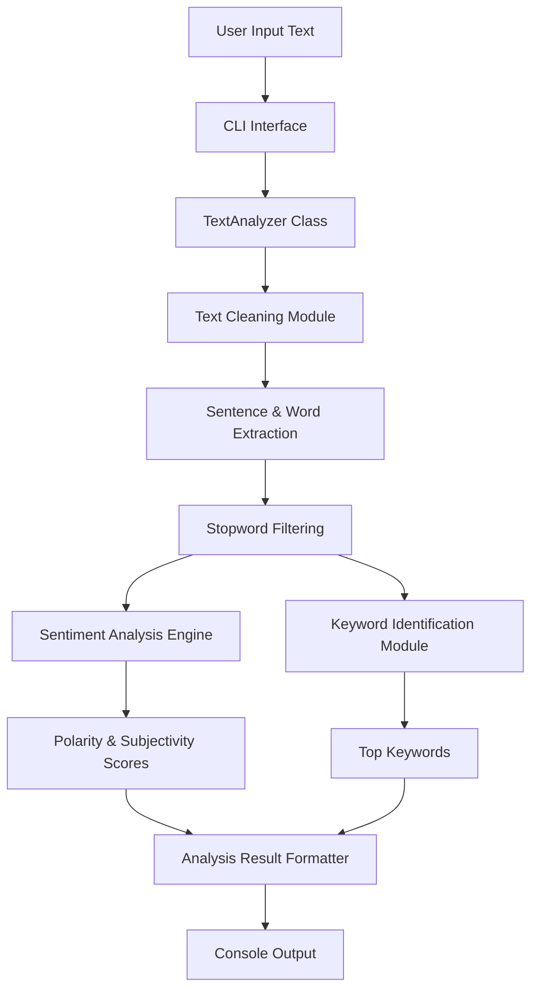

# 🧠 Text Analyzer (Python)

A lightweight **Python-based Text Analyzer** that cleans text, extracts meaningful words and sentences, performs basic **sentiment analysis**, and identifies **keywords** using simple natural language processing techniques. Designed for learning, experimentation, and small-scale text analysis tasks.

---

---
## ✨ Features

* 🧹 **Text Cleaning** – Removes special characters, numbers, and normalizes text
* 🧾 **Sentence Extraction** – Splits input into readable sentences
* 🧠 **Stopword Removal** – Filters out common English stopwords
* 😊 **Sentiment Analysis** – Calculates polarity and subjectivity using word matching
* 🔑 **Keyword Identification** – Finds top keywords based on frequency
* ⚡ **Simple CLI Interface** – Easy to run and test

---

## 🛠️ Tech Stack

* **Language:** Python 3
* **Libraries Used:**

  * `re` (Regular Expressions)

No external dependencies. Clean and minimal by design.

---

## 📂 Project Structure

```
text-analyzer/
│
├── text_analyzer.py   # Main Python script
└── README.md          # Project documentation
```

---

## 🚀 Getting Started

### 1️⃣ Clone the Repository

```bash
git clone https://github.com/your-username/text-analyzer.git
cd text-analyzer
```

### 2️⃣ Run the Program

```bash
python text_analyzer.py
```

### 3️⃣ Enter Text for Analysis

The program will prompt you to input text and then display:

* Extracted sentences
* Filtered words
* Sentiment polarity & subjectivity
* Identified keywords

---

## 📊 Output Explanation

* **Polarity**

  * Range: `-1 → +1`
  * Positive value → positive sentiment
  * Negative value → negative sentiment

* **Subjectivity**

  * Range: `0 → 1`
  * Higher value → more opinion-based content

---

## 🧪 Example Use Cases

* Academic NLP experiments
* Beginner-friendly sentiment analysis
* Text preprocessing demonstrations
* Mini projects and lab exercises

---

## ⚠️ Limitations

* Rule-based sentiment analysis (no ML model)
* Fixed stopword and sentiment word lists
* English language only

This is intentional—to keep the logic transparent and educational.

---

## 🔮 Future Improvements

* Add machine learning–based sentiment analysis
* Support multiple languages
* Improve keyword extraction (TF-IDF)
* Add file input support
* Convert into a reusable Python package

---

## 🤝 Contributing

Contributions are welcome.

1. Fork the repository
2. Create a new branch
3. Commit your changes
4. Open a Pull Request

---

## 📜 License

This project is licensed under the **MIT License**.

---

## 🌟 Author

Developed with curiosity and logic.

If you like this project, consider giving it a ⭐ on GitHub — it helps others discover it.
